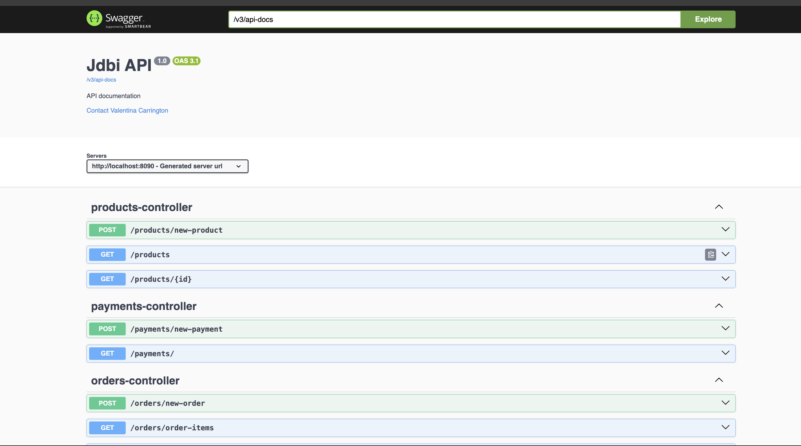

# JDBI Example Project

This project is a demonstration how to use Java with PostgreSQL with JDBI and Liquibase

* JDBI is a high-level API built on top of JDBC. It simplifies database interactions by reducing boilerplate code and providing a more user-friendly and declarative approach to database operations. 
* The project connects to PostgreSQL with Liquibase. 
* During testing, it connects to H2 in-memory database with test data to run unit tests.

# Getting Started

### Swagger-UI

Swagger UI provides a web-based interface to visualize and interact with the API's endpoints.
To access Swagger UI:
1. Start the application server.
2. Open a web browser.
3. Navigate to the Swagger UI URL, typically in the format: `http://<server_address>:8090/swagger-ui/index.html`.
4. Use the interface to explore available API endpoints, view request/response schemas, and test API calls.



### Database ER Diagram


## Testing
### Run all tests
```bash
    ./mvnw test
```

### Run single test
```bash
    ./mvnw -Dtest=<Test_Name> test
```

